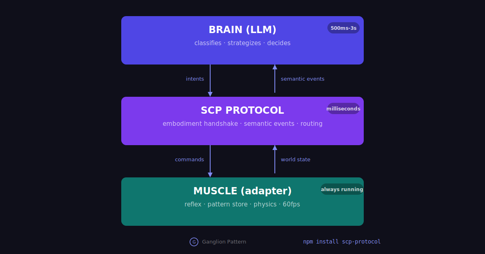
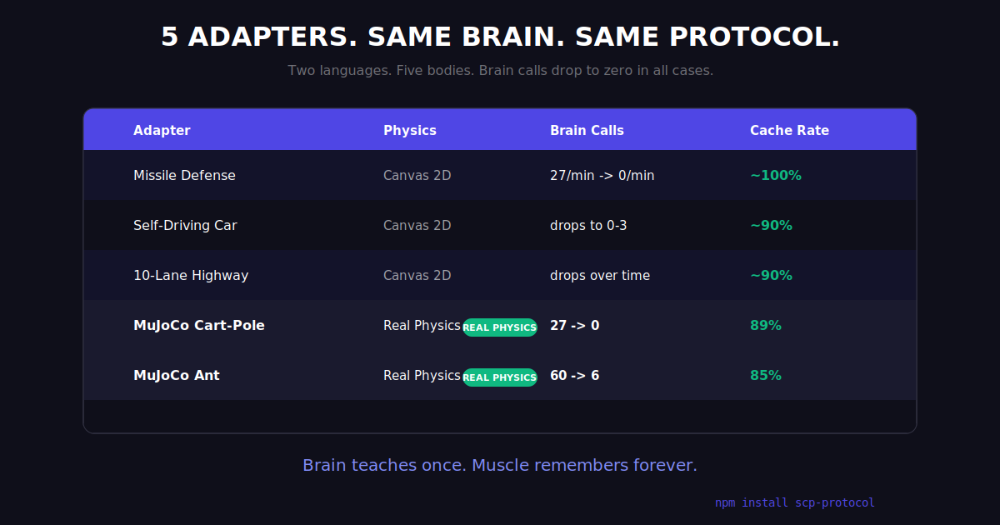
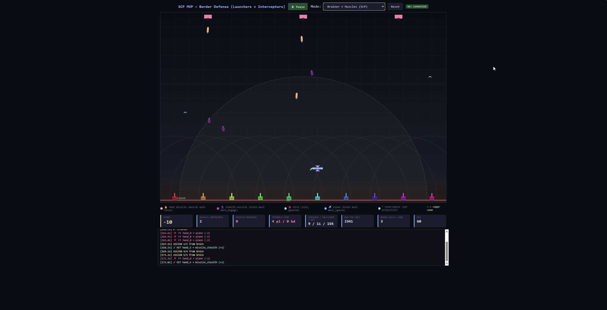

<p align="center">
  
</p>

<h1 align="center">Spatial Context Protocol</h1>

<p align="center">
  Real-time AI execution runtime for embodied systems.
  <br/>
  <strong>In MCP the brain asks. In SCP the muscle asks.</strong>
</p>

<p align="center">
  <a href="https://npmjs.com/package/scp-protocol"></a>
  <a href="https://github.com/srk0102/SCP"></a>
  <a href="https://srk-e37e8aa3.mintlify.app"></a>
</p>

> Any LLM. Any body. Zero training.
> Brain calls dropped from 27 to 0 across 5 adapters including real MuJoCo physics.

---

## What SCP does

SCP connects any LLM to any body -- physical or virtual -- without retraining. The body runs at 60fps. The brain sleeps until needed. Brain calls drop to near-zero as the muscle learns.

| | MCP | SCP |
|---|---|---|
| **Who initiates** | Brain asks, tool answers | Body acts, brain advises |
| **Body** | Passive (waits) | Active (runs at 60fps) |
| **Memory** | None | Pattern store replays brain decisions |
| **Cost over time** | Constant | Drops to near zero |

---

## Demo: MuJoCo cart-pole (real physics)

[](https://res.cloudinary.com/still-studying/video/upload/Screen_Recording_2026-04-13_010202_qlnftl.mp4)

*Click to watch.* Real MuJoCo physics. Real joint constraints. Brain learns to balance the pole, then goes silent.

```
Loop  1: brain=31  cache=119  reflex=43   <- brain handles most decisions
Loop  5: brain= 5  cache=153  reflex=35   <- cache taking over
Loop 12: brain= 4  cache=148  reflex=40   <- muscle learned
Loop 24: brain= 1  cache=158  reflex=35   <- brain nearly silent
```

---

## Architecture



## Standing on shoulders

SCP builds on Subsumption Architecture (Rodney Brooks, 1986), which first proposed splitting robot control into fast bottom-up layers rather than slow top-down reasoning.

What SCP adds for the LLM era:
- Any LLM as the brain layer. Zero training required.
- Open protocol. Three files to write an adapter.
- Pattern store that learns from LLM decisions.
- Cost drops to near zero over time.

---

## Five adapters, same brain, same protocol



| Adapter | Physics | Brain calls | Cache rate |
|---|---|---|---|
| Missile Defense | Canvas 2D | 27 -> 0/min | ~100% |
| Self-Driving Car | Canvas 2D | drops to 0-3 | ~90% |
| 10-Lane Highway | Canvas 2D | drops over time | ~90% |
| MuJoCo Cart-Pole | Real physics | 27 -> 0 | 89% |
| MuJoCo Ant | Real physics | 60 -> 6 | 85% |

Same Nova Micro. Same bridge. Same protocol. Zero code changes between adapters.

---

## Install

```bash
npm install scp-protocol
```

```javascript
const { PatternStore, SCPAdapter, OllamaBridge } = require('scp-protocol')

const store = new PatternStore({
  featureExtractor: (entity) => ({
    kind: entity.kind,
    speed: entity.speed > 5 ? 'fast' : 'slow',
  }),
})

// Reflex: fires in 0-5ms, before cache or brain
adapter.reflex('emergency', (state) => {
  if (state.distance < 5) return true
})

// Muscle loop
const cached = store.lookup(entity)
if (cached) {
  execute(cached.decision)        // cache hit: 0.1ms, $0
} else {
  const d = await brain.invoke(e) // cache miss: ask brain
  store.learn(entity, d)          // learn for next time
}
```

76 tests. Zero external services. SQLite ships bundled.

---

## Quick start

```bash
git clone https://github.com/srk0102/SCP.git && cd SCP

# Terminal 1: serve an adapter
cd adapters/self-driving-car && python -m http.server 8080

# Terminal 2: start the bridge
cd bridge
PROMPT_PATH=../adapters/self-driving-car/system-prompt.md node qwen-mcp-bridge.js
```

Open `http://localhost:8080/muscle.html`. Press Play.

---

## Repo structure

```
SCP/
  schema/                 Frozen protocol (v0.1.0)
  server/                 MCP server + WebSocket bridge
  bridge/                 LLM bridge (Bedrock Nova Micro)
  adapters/
    aim-lab/              Missile defense
    self-driving-car/     3-lane road
    highway/              10-lane highway
    mujoco-cartpole/      Cart-pole (Python + MuJoCo)
    mujoco-ant/           Quadruped ant (Python + MuJoCo)
  packages/scp-core/      npm package
    bridges/              Bedrock, Ollama, OpenAI
    transports/           WebSocket, HTTP
    tests/                76 tests, 0 failures
  examples/drone-patrol/  Node.js simulation
```

---

## Writing an adapter

Three files. That is the entire contract.

```
adapters/your-body/
  embodiment.json    -- describe your body
  muscle.js          -- physics + sensors + pattern store
  system-prompt.md   -- tell the brain what to classify
```

The bridge, server, and protocol require zero changes.

---

## More demos

<table>
<tr>
<td width="50%" align="center">
<a href="assets/missile-defense.mp4"></a>
<br/><sub>Missile Defense -- 10 launchers, brain classifies stealth</sub>
</td>
<td width="50%" align="center">
<a href="assets/car-simulation.mp4"></a>
<br/><sub>Self-Driving Car -- ambulance yield, obstacle avoidance</sub>
</td>
</tr>
</table>

---

## Links

- **Docs:** https://srk-e37e8aa3.mintlify.app
- **npm:** https://npmjs.com/package/scp-protocol
- **AnimTOON-3B:** https://huggingface.co/srk0102/AnimTOON-3B

## License

[MIT](LICENSE) -- [srk0102](https://github.com/srk0102)
