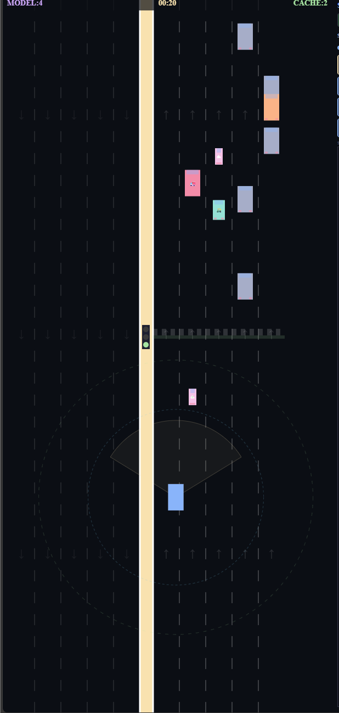

# SCP — Spatial Context Protocol

**MCP connects a brain to information. SCP connects a brain to a body that's already moving.**

---

## The Problem

Tesla's FSD reacts in milliseconds. But it only drives Teslas.

Every LLM-controlled robot, character, or vehicle today is welded shut. The brain is custom-trained for one body. Swap the body, rebuild everything from scratch.

There is no open protocol that lets any LLM control any body — physical or virtual — without retraining.

SCP is that protocol.

---

## What SCP Is

SCP is three additions to MCP (Anthropic's Model Context Protocol):

**1. The Embodiment Handshake**
On connect, the body sends a JSON description of itself. "I am 10 missile launchers. I have heat sensors. My cooldown is 550ms." The brain reads this once. Swap the body, swap the JSON. Zero retraining.

**2. Semantic Events (body → brain)**
MCP is pull-only. The brain asks, the tool answers. SCP adds: the body pushes events UP without being asked. "Cold contact unclassified." "Missile breached ground — pain signal." "Hot contact ambiguous." The brain wakes ONLY when the muscle can't handle something. Most of the time, the brain sleeps.

**3. The Muscle Layer (body acts without brain)**
MCP assumes nothing happens until the brain calls a tool. SCP adds: the body runs continuously at 60fps. The brain's tool call drops into a system that's already moving. The muscle never stops to wait.

---

## What This Means

```
Brain (LLM)       → classifies, strategizes, decides (seconds)
Protocol (SCP)    → messenger between brain and muscle (milliseconds)
Muscle (adapter)  → acts, reacts, remembers (60fps, always running)
```

The muscle acts first — always. It handles everything it knows. When it can't decide, it takes a safe default action and asks the brain async. The brain responds, the muscle adjusts. The pattern store replays the brain's past decisions so it never needs to ask twice. In MCP the brain asks. In SCP the muscle asks.

---

## The Demo: Border Missile Defense

A simulation with 10 missile launchers defending against 4 entity types:

- Heat missiles — muscle auto-fires, no brain needed
- Stealth missiles — cold, invisible to heat sensor, brain must classify
- Birds — cold, harmless, ignored
- Passenger planes — hot engine signal, muscle would shoot them, brain vetoes

**Three modes, three results:**

| Mode | Heat missiles | Stealth missiles | Friendly fire | Brain calls/min |
|---|---|---|---|---|
| No-brainer (heat sensor only) | Intercepted | All missed | Shoots planes | 0 |
| Brainer (LLM only) | Most missed (too slow) | Some caught | None | 60+ |
| SCP (muscle + brain) | Intercepted | Brain classifies, muscle fires | Vetoed | 15-27 |

**What was actually measured:**

```
125+ assign_targets calls landing reliably
Stealth missile intercepts: brain mark_engage → muscle fires
Plane vetos: brain mark_ignore → muscle skips
Session 1: Brain calls/min = 27
Session 2: Brain calls/min dropping (pattern store learning)
```

---

## The Pattern Store (Muscle Memory)

After 2 consistent brain decisions on the same pattern, the muscle replays what the brain already decided — without asking again. No brain call. Zero latency. Zero cost.

The brain is not bypassed. It is cached. Same outcome. Faster. Cheaper. Still correctable when the brain contradicts it. That is exactly how biological muscle memory works.

---

## How to Run It

Two terminals. No GPU. No local model. No training.

```bash
# Terminal 1 — serve the adapter
cd adapters/aim-lab
python -m http.server 8080

# Terminal 2 — start the bridge
cd client
node qwen-mcp-bridge.js
```

Open `http://localhost:8080/muscle.html`. Select SCP mode. Press Play.

**Requirements:**
- Node.js 20+
- AWS account with Bedrock access (Amazon Nova Micro enabled)
- `.env` file with `S3_AWS_ACCESS_KEY_ID`, `S3_AWS_SECRET_ACCESS_KEY`, `S3_AWS_REGION`

Cost: ~$0.001 per brain call. Most runs cost less than $0.10.

---

## Three Adapters (Same Protocol, Same Brain)

| Adapter | Body | What it proves |
|---|---|---|
| **Missile Defense** (`adapters/aim-lab/`) | 10 launchers, 4 entity types | Brain classifies stealth missiles + vetoes planes |
| **Self-Driving Car** (`adapters/self-driving-car/`) | Car on 3-lane road | Sensor-based classification, lane driving, halt validation |
| **10-Lane Highway** (`adapters/highway/`) | 5+5 lane divided highway | Traffic signals, opposite traffic, rash drivers, rickshaws |

Same MCP server. Same bridge. Same Nova Micro. **Zero code changes between adapters** — just swap the folder and set `PROMPT_PATH`.

```bash
# Run car adapter instead of missiles
cd adapters/self-driving-car && python -m http.server 8080
PROMPT_PATH=../adapters/self-driving-car/system-prompt.md node client/qwen-mcp-bridge.js

# Run highway adapter
cd adapters/highway && python -m http.server 8080
PROMPT_PATH=../adapters/highway/system-prompt.md node client/qwen-mcp-bridge.js
```

---

## Writing an Adapter

Three files. That is the entire contract.

```
adapters/your-body/
  embodiment.json    → describe your body
  muscle.js          → physics + sensors + pattern store
  system-prompt.md   → tell the brain what to classify
```

The bridge, MCP server, and pattern store require zero changes.

---

## What This Is Not

Not a competition with Tesla or Boston Dynamics. They build the best brain for one body. SCP builds the open protocol between any brain and any body.

Not a new ML technique. SCP is the open distribution layer.

Not production robotics. This is a protocol proof with simulations. Hardware comes when someone writes a hardware adapter.

---

## The One-Line Pitch

Any LLM that produces JSON tool calls can control any body through SCP — with zero training. The muscle handles speed. The brain handles intelligence. The protocol connects them. The muscle replays what the brain already decided — without asking again.

---

## License

MIT

---

## Built by

[srk0102](https://github.com/srk0102) — also building [AnimTOON-3B](https://huggingface.co/srk0102/AnimTOON-3B), an open model for SVG character animation. AnimTOON generates the character. SCP drives how it behaves.
