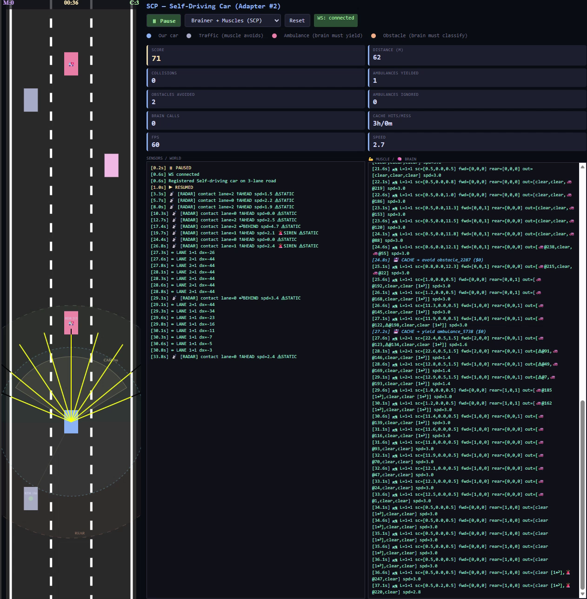

# SCP — Spatial Context Protocol

**MCP connects a brain to information. SCP connects a brain to a body that's already moving.**

**In MCP the brain asks. In SCP the muscle asks.**

---

## Demos

<table>
<tr>
<td width="50%" align="center">

### Missile Defense

[](videos/missle%20launching%20system.mp4)

*Click to watch video* | 10 launchers defending a border. Muscle fires on heat. Brain classifies stealth missiles and vetoes planes.

</td>
<td width="50%" align="center">

### Self-Driving Car

[](videos/car-simulation.mp4)

*Click to watch video* | 3-lane road with traffic, ambulances, obstacles. Same brain, different body. Zero protocol changes.

</td>
</tr>
</table>

---

## The Problem

Every LLM-controlled robot, character, or vehicle today is welded shut. The brain is custom-trained for one body. Swap the body, rebuild everything from scratch.

There is no open protocol that lets any LLM control any body — physical or virtual — without retraining. SCP is that protocol.

---

## What SCP Adds to MCP

| | MCP | SCP |
|---|---|---|
| **Who initiates** | Brain asks, tool answers | Body acts, brain advises |
| **Body behavior** | Passive (waits for brain) | Active (runs at 60fps) |
| **Events** | Pull only | Body pushes events up |
| **Memory** | None | Pattern store replays past brain decisions |
| **Latency** | Every action waits for LLM | Muscle handles 99%, brain handles 1% |

**Three additions:**

1. **Embodiment Handshake** — Body sends JSON description on connect. Swap the body, swap the JSON. Zero retraining.
2. **Semantic Events** — Body pushes events UP without being asked. Brain wakes only when muscle can't handle something.
3. **Muscle Layer** — Body runs at 60fps. Brain's tool call drops into a system that's already moving.

---

## Architecture

```
Brain (LLM)       — classifies, strategizes, decides (seconds)
Protocol (SCP)    — messenger between brain and muscle (milliseconds)
Muscle (adapter)  — acts, reacts, remembers (60fps, always running)
```

The muscle acts first. When it can't decide, it takes a safe default action and asks the brain async. The brain responds, the muscle adjusts. The pattern store replays past brain decisions so it never asks twice.

---

## Results: Missile Defense

| Mode | Heat missiles | Stealth missiles | Friendly fire | Brain calls/min |
|---|---|---|---|---|
| No-brainer (sensors only) | Intercepted | All missed | Shoots planes | 0 |
| Brainer (LLM only) | Most missed (too slow) | Some caught | None | 60+ |
| **SCP (muscle + brain)** | **Intercepted** | **Brain classifies, muscle fires** | **Vetoed** | **15-27** |

## Results: Self-Driving Car

| Metric | Value |
|---|---|
| Score | 165+ |
| Collisions | 0-1 |
| Ambulances yielded | 4 |
| Obstacles avoided | 3-4 |
| Brain calls | 0-3 (cache handles rest) |
| Cache hits | 5-9 at $0 each |

---

## Pattern Store (Muscle Memory)

After 2 consistent brain decisions on the same pattern, the muscle replays what the brain already decided — without asking again. Zero latency. Zero cost.

The brain is not bypassed. It is cached. Same outcome, faster, cheaper, still correctable. That is exactly how biological muscle memory works.

---

## Three Adapters, Same Brain

| Adapter | Body | What it proves |
|---|---|---|
| **Missile Defense** (`adapters/aim-lab/`) | 10 launchers, 4 entity types | Brain classifies stealth + vetoes planes |
| **Self-Driving Car** (`adapters/self-driving-car/`) | Car on 3-lane road | Lane changes, ambulance yield, obstacle avoidance |
| **10-Lane Highway** (`adapters/highway/`) | 5+5 lane divided highway | Traffic signals, lane narrowing, chaos mode |

Same server. Same bridge. Same Nova Micro. **Zero code changes between adapters.**

---

## How to Run

```bash
# Terminal 1 — serve an adapter
cd adapters/self-driving-car && python -m http.server 8080

# Terminal 2 — start the bridge (spawns MCP server internally)
cd client
PROMPT_PATH=../adapters/self-driving-car/system-prompt.md node qwen-mcp-bridge.js
```

Open `http://localhost:8080/muscle.html`. Select SCP mode. Press Play.

Swap adapters by changing the folder:

```bash
# Missile defense
cd adapters/aim-lab && python -m http.server 8080

# Highway
cd adapters/highway && python -m http.server 8080
```

**Requirements:** Node.js 20+, AWS Bedrock access (Nova Micro), `.env` with AWS credentials.

Cost: ~$0.001 per brain call. Most runs cost less than $0.10.

---

## Writing an Adapter

Three files. That is the entire contract.

```
adapters/your-body/
  embodiment.json    — describe your body
  muscle.js          — physics + sensors + pattern store
  system-prompt.md   — tell the brain what to classify
```

The bridge, MCP server, and protocol require zero changes.

---

## The Pitch

Same LLM, same protocol, zero training. Adapter #1 defended a border with 10 missile launchers. Adapter #2 drove a car through traffic with ambulances and obstacles. The protocol didn't change. The brain didn't change. Just the adapter.

---

## License

MIT

## Built by

[srk0102](https://github.com/srk0102)
